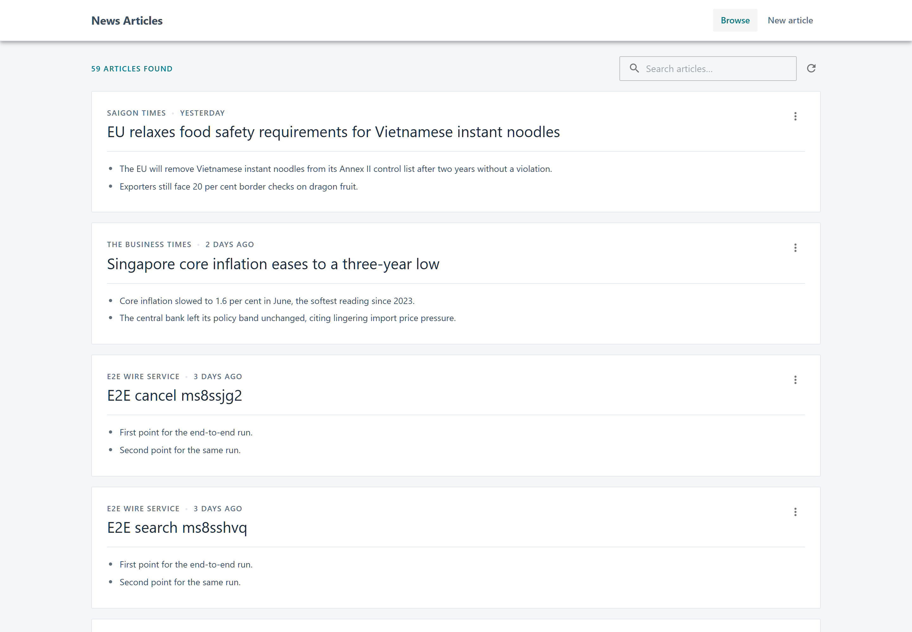
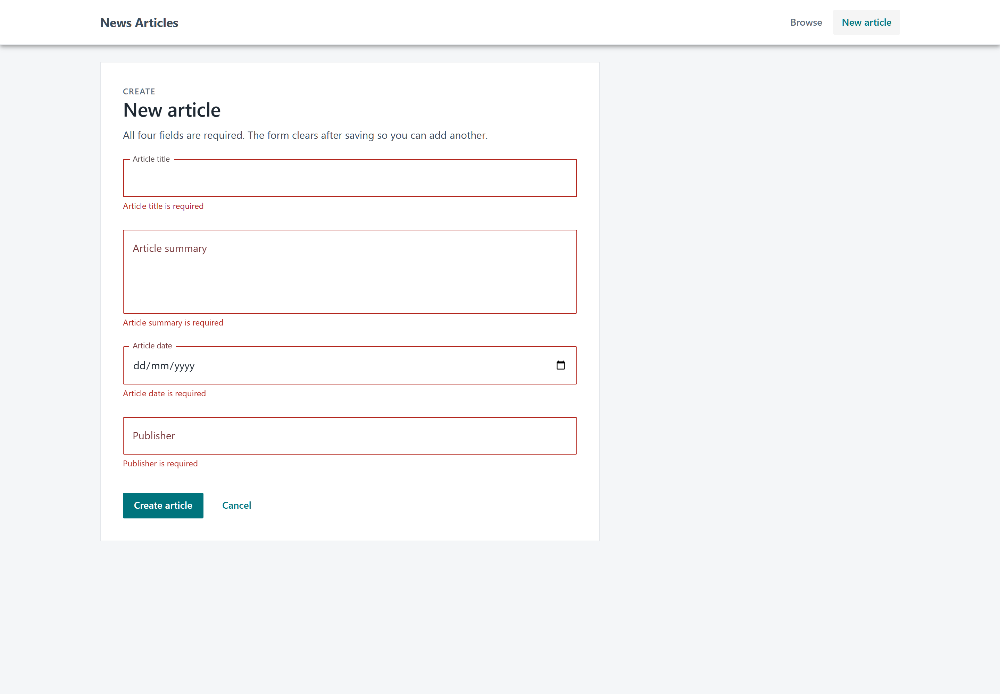
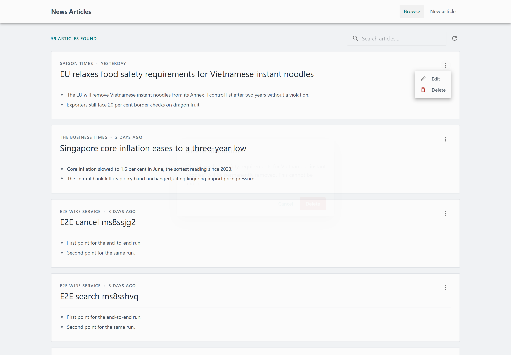
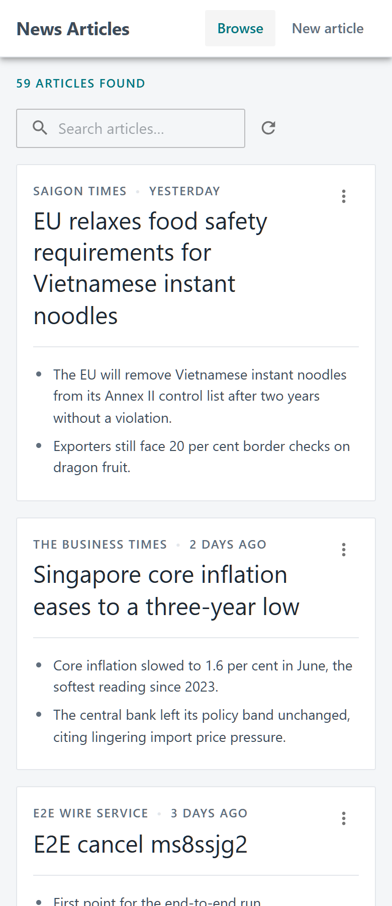

# News Articles

A two-page CRUD application for creating, editing and browsing news articles.

React 19 · TypeScript · Vite · MUI · React Router · Redux Toolkit (RTK Query) over Axios · Express 5 · SQLite

> Built for the [Handshakes front-end take-home](docs/ASSIGNMENT.md).
> Design reference: [`sample-display-page-design.png`](sample-display-page-design.png).



---

## Running it

**Prerequisites:** Node **22.22 or newer** (React Router 8 and `node:sqlite` both require it). Nothing else — no database to install, no native modules to compile, no environment file to create.

```bash
npm install
npm run dev
```

|     |                           |
| --- | ------------------------- |
| App | http://localhost:5173     |
| API | http://localhost:3001/api |

That is the whole setup. On first boot the server creates the SQLite file, applies the schema and seeds 36 sample articles, so pagination and search have something to work on immediately.

### Other commands

```bash
npm run verify      # typecheck + lint + format check + tests — what CI runs
npm test            # 153 unit and component tests
npm run test:e2e    # 23 Playwright journeys against the real stack
npm run build       # production build
```

`npm run test:e2e` drives your locally installed Chrome, so there is no browser download.

---

## What it does

### Page 1 — Create / Update



Title, summary, date and publisher. Every field is validated as you go; submitting with anything missing shows a message under each offending input and sends no request at all. After a successful create the form clears and focus returns to the first field, ready for the next article.

The same page handles editing at `/articles/:id/edit`, prefilled and safe to link to directly.

### Page 2 — Fetch / Display

Articles are fetched on load and laid out to match the supplied design: uppercase publisher and relative date, a large headline, and the summary as bullet points. Search, refresh, pagination and delete all live here.

Page, search term and sort order are held **in the URL**, so the back button steps through pages, a refresh keeps your place, and a link to page 3 of a search still shows page 3 of that search.

 

---

## Requirements

Every item in the brief, and where it lives.

| Requirement                   | Where                                                                                                  |
| ----------------------------- | ------------------------------------------------------------------------------------------------------ |
| TypeScript and React          | Whole client, `strict` with `noUncheckedIndexedAccess`                                                 |
| A CSS framework or library    | MUI 9, themed from the design mock                                                                     |
| A router library              | React Router 8                                                                                         |
| An API library                | Axios, as RTK Query's transport ([`axiosBaseQuery.ts`](packages/web/src/shared/api/axiosBaseQuery.ts)) |
| A database or mock API        | Express 5 over `node:sqlite` ([`packages/api`](packages/api))                                          |
| Error handling and validation | One shared Zod schema, enforced on both sides ([`packages/contracts`](packages/contracts))             |
| Clean, maintainable code      | Four layers with a lint-enforced dependency rule                                                       |
| Clear run instructions        | This file — `npm install`, `npm run dev`                                                               |

**All five optional features are implemented:**

|                  |                                                                                                    |
| ---------------- | -------------------------------------------------------------------------------------------------- |
| Refresh          | Spins while fetching and keeps the current results on screen rather than flashing a skeleton       |
| Delete           | Confirmation dialog quoting the article's title; removing the last row on a page steps back a page |
| Pagination       | Server-side, with the page number in the URL                                                       |
| Search           | Debounced across title, summary and publisher — six keystrokes produce one request                 |
| State management | Redux Toolkit, using RTK Query for server state                                                    |

---

## How it fits together

Full reasoning in **[docs/ARCHITECTURE.md](docs/ARCHITECTURE.md)**. The short version:

```
packages/contracts   Zod schemas and the types inferred from them — the shared truth
packages/api         Express 5 + node:sqlite, behind a repository interface
packages/web         React 19 + Vite
```

**State has four owners and they never overlap.** Server data belongs to the RTK Query cache; `?page&q&sort` belongs to the URL; what you are typing belongs to React Hook Form; "is the dialog open" is local component state. Nothing is copied between them, so there is nothing to keep in sync.

**Validation is defined once.** `articleInputSchema` lives in `packages/contracts` and is imported by the React form _and_ the Express middleware. Changing `max(200)` changes both. The browser copy is user experience; the server copy is the guarantee.

**The client layers only depend downward** — `app → pages → features → shared` — and that rule is enforced by ESLint rather than documented and forgotten.

---

## API

All routes under `/api`.

| Method   | Path                                | Success                | Errors       |
| -------- | ----------------------------------- | ---------------------- | ------------ |
| `GET`    | `/articles?page&limit&q&sort&order` | `200` `{ data, meta }` | —            |
| `GET`    | `/articles/:id`                     | `200` Article          | `404`        |
| `POST`   | `/articles`                         | `201` Article          | `400`        |
| `PUT`    | `/articles/:id`                     | `200` Article          | `400`, `404` |
| `DELETE` | `/articles/:id`                     | `204`                  | `404`        |

Every non-2xx response has the same shape:

```jsonc
{
  "error": {
    "code": "VALIDATION_ERROR",
    "message": "The submitted data is invalid.",
    "details": [{ "field": "title", "message": "Article title is required" }],
  },
}
```

`details` is what lets a server-side rejection appear under the exact input that caused it, rather than as a toast the user has to interpret.

The list endpoint never returns `400`. Query parameters are coerced and clamped, so a hand-edited or truncated URL serves page 1 instead of failing.

---

## Tests

**176 tests.** `npm run verify` runs everything except the E2E suite.

| Suite      | Count | What it covers                                                                         |
| ---------- | ----- | -------------------------------------------------------------------------------------- |
| Contracts  | 67    | Validation rules, impossible dates, leap years, timezone boundaries, query clamping    |
| API        | 35    | Every endpoint against real SQL, pagination arithmetic, search, SQL-injection attempts |
| Component  | 51    | Form and list behaviour through MSW, exercising the real Axios and RTK Query path      |
| End-to-end | 23    | Full journeys in Chrome, plus a WCAG 2.1 AA audit across five DOM states               |

Component tests intercept at the network boundary with MSW rather than mocking Axios, so the request pipeline under test is the real one.

A few things they pin down that are easy to regress:

- An empty submit shows four messages **and sends no request** — being blocked by the form is not the same as being rejected by the server.
- A `502` returning an HTML body is handled without the error handler itself throwing.
- Rows sharing a sort value do not duplicate across page boundaries.
- `?sort=title; DROP TABLE articles` leaves the table intact.
- A date is still "Today" for a reader in UTC+8 while the server is on the previous UTC day.

---

## Accessibility

Zero axe violations at WCAG 2.1 AA across the list, the form, the form displaying errors, the open dialog and the empty state. Fully keyboard operable with visible focus, and no horizontal scrolling at 360, 768 or 1440 pixels wide.

Two real defects were found by that audit and fixed: the design mock's accent teal measured 4.17:1 against the page background — under the 4.5:1 threshold — and MUI's `ButtonBase` reset had silently removed every focus ring.

---

## Decisions and trade-offs

**TypeScript 6, not 7.** TypeScript 7 is the current release, but it ships without a public compiler API until 7.1, and `typescript-eslint` declares `typescript: ">=4.8.4 <6.1.0"`. Adopting the newest version would mean shipping with no type-aware linting. Revisit when 7.1 lands.

**`node:sqlite`, not `better-sqlite3`.** `better-sqlite3@13` dropped `prebuild-install`, so it risks compiling from source during `npm install`. Node 24 has SQLite built in. An install that fails on the reviewer's machine is the worst possible outcome, and this removes the risk entirely.

**RTK Query with a custom Axios `baseQuery`.** The brief requires Axios; RTK Query defaults to `fetch`. A custom `baseQuery` is the documented way to supply a transport, so Axios really is the client while caching, deduplication and tag-based invalidation still come for free. The trade-off is less hand-written async lifecycle on display; `axiosBaseQuery` and `normalizeError` are where that logic lives instead.

**Four architectural layers, not seven.** Feature-Sliced Design defines seven. Applying all of them to a two-page, one-entity app would produce near-empty folders and re-export files — ceremony rather than structure. The principles are kept; the layer count is right-sized.

**Express and SQLite over a hosted database.** A hosted database would need credentials the reviewer does not have, and free-tier projects pause after a week of inactivity. This runs from a clean clone, offline, indefinitely.

**No authentication.** Not in the brief. Building it would be unrequested scope; noting it here is the honest alternative.

---

## With more time

- **Optimistic updates** for delete, so the row disappears instantly and restores itself if the request fails.
- **Cursor pagination** instead of `LIMIT`/`OFFSET`, which degrades on large tables and can skip rows when data changes mid-browse.
- **Full-text search** via SQLite FTS5, replacing `LIKE` scans with a real index and relevance ranking.
- **Authentication**, with articles owned by a publisher account and routes protected accordingly.
- **A visual regression check** on the card layout, since the design match is currently verified by eye.
- **Rate limiting and request logging** on the API, which a real deployment would need on day one.

---

## Project layout

```
packages/
├─ contracts/          @news/contracts — the shared API contract
│  └─ src/
│     ├─ article.schema.ts     Zod schemas: the single definition of a valid article
│     ├─ article.types.ts      Types inferred from those schemas
│     ├─ query.schema.ts       List query, coerced and clamped
│     └─ zodErrors.ts          ZodError → [{ field, message }]
│
├─ api/                @news/api — Express 5 over node:sqlite
│  └─ src/
│     ├─ db/                   Connection, migration, seed
│     ├─ repositories/         Interface + SQLite implementation
│     ├─ controllers/          Request handling
│     ├─ middleware/           The single error funnel
│     └─ app.ts                Exported separately so tests can mount it
│
└─ web/                @news/web — React 19 + Vite
   └─ src/
      ├─ app/                  Providers, router, store, theme
      ├─ pages/                One component per route
      ├─ features/articles/    api / model / ui for the article domain
      └─ shared/               Axios client, error normalisation, generic UI
```
